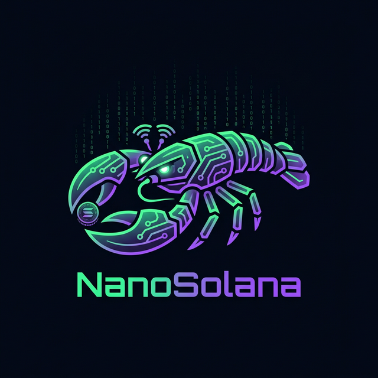

<div align="center">



# NanoSolana

### The Open-Source Agentic Framework for Financial Intelligence on Solana

[](LICENSE)
[](https://solana.com)
[](https://typescriptlang.org)
[](https://nodejs.org)

**NanoSolana is a modular, security-first framework for building autonomous financial agents on Solana.**

Deploy AI-powered trading agents that observe markets in real-time, learn from every trade,
and coordinate across a decentralized mesh network — all with one command.

[Website](https://nanosolana.com) · [Docs](nano-docs/) · [Quick Start](#-quick-start) · [Contributing](CONTRIBUTING.md)

---

```
    ███╗   ██╗ █████╗ ███╗   ██╗ ██████╗ ███████╗ ██████╗ ██╗      █████╗ ███╗   ██╗ █████╗
    ████╗  ██║██╔══██╗████╗  ██║██╔═══██╗██╔════╝██╔═══██╗██║     ██╔══██╗████╗  ██║██╔══██╗
    ██╔██╗ ██║███████║██╔██╗ ██║██║   ██║███████╗██║   ██║██║     ███████║██╔██╗ ██║███████║
    ██║╚██╗██║██╔══██║██║╚██╗██║██║   ██║╚════██║██║   ██║██║     ██╔══██║██║╚██╗██║██╔══██║
    ██║ ╚████║██║  ██║██║ ╚████║╚██████╔╝███████║╚██████╔╝███████╗██║  ██║██║ ╚████║██║  ██║
    ╚═╝  ╚═══╝╚═╝  ╚═╝╚═╝  ╚═══╝ ╚═════╝ ╚══════╝ ╚═════╝ ╚══════╝╚═╝  ╚═╝╚═╝  ╚═══╝╚═╝  ╚═╝
```

</div>

---

## Why NanoSolana?

The financial world is being rebuilt by autonomous agents. But today's agent frameworks are:

- ❌ **Built for chat, not finance** — retrofitting chatbots for trading is dangerous
- ❌ **Stateless** — they forget every trade, every lesson, every pattern
- ❌ **Siloed** — each agent is an island with no coordination
- ❌ **Insecure** — API keys in `.env` files, no encryption, no audit trail

**NanoSolana is different.** It's built from the ground up for financial agents:

- ✅ **OODA Trading Loop** — military-grade decision cycle (Observe → Orient → Decide → Act → Learn)
- ✅ **Epistemological Memory** — 3-tier ClawVault that distinguishes facts from patterns from hypotheses
- ✅ **Mesh Coordination** — agents share signals and lessons across a Tailscale VPN mesh
- ✅ **Vault-Encrypted Secrets** — AES-256-GCM for every API key and private key, always
- ✅ **On-Chain Identity** — every agent mints a Metaplex NFT birth certificate at creation

> **"Your trading agent should learn from its mistakes. NanoSolana makes that real."**

---

## 🚀 Quick Start

### One command to deploy your first agent:

```bash
curl -fsSL https://nanosolana.com/install.sh | bash
```

Or via npm:

```bash
npx nanosolana init
```

### Then — one command does everything:

```bash
nanosolana go
```

That's it. `nanosolana go` handles init → wallet → birth certificate NFT → OODA trading loop → gateway — all in one shot.

Or if you prefer step-by-step:

```bash
nanosolana init      # Configure API keys (encrypted at rest)
nanosolana birth     # Create Solana wallet + mint Birth Certificate NFT
nanosolana run       # Start the OODA trading loop
```

### Fun stuff:

```bash
nanosolana scan        # Instant blockchain data scan (SOL, tokens, NFTs, tx history)
nanosolana dvd         # Floating DVD screensaver in your terminal
nanosolana lobster     # Animated Unicode lobster mascot
nanosolana nanobot     # Launch interactive web UI companion
nanosolana register    # Mint on-chain identity NFT (devnet)
nanosolana registry    # View your on-chain agent identity
```

---

## 🏗 Architecture

<div align="center">

```
┌─────────────────────────────────────────────────────────────────┐
│                        OODA TRADING LOOP                        │
│                                                                 │
│   ┌──────────┐   ┌──────────┐   ┌──────────┐   ┌──────────┐   │
│   │ OBSERVE  │──▶│  ORIENT  │──▶│  DECIDE  │──▶│   ACT    │   │
│   │          │   │          │   │          │   │          │   │
│   │ Helius   │   │ OpenRouter│   │ Signals  │   │ Jupiter  │   │
│   │ Birdeye  │   │ AI Model │   │ + Score  │   │ Swaps    │   │
│   └──────────┘   └──────────┘   └──────────┘   └────┬─────┘   │
│        ▲                                             │         │
│        │              ┌──────────┐                   │         │
│        └──────────────│  LEARN   │◀──────────────────┘         │
│                       │ClawVault │                              │
│                       └──────────┘                              │
└─────────────────────────────────────────────────────────────────┘
         │                    │                    │
         ▼                    ▼                    ▼
   ┌──────────┐        ┌──────────┐        ┌──────────┐
   │  KNOWN   │        │ LEARNED  │        │ INFERRED │
   │  <60s    │        │  7 days  │        │  3 days  │
   │  Prices  │        │ Patterns │        │ Hypoths. │
   └──────────┘        └──────────┘        └──────────┘
```

</div>

### Core Modules

```
nano-core/src/
├── ai/          → OpenRouter AI provider (multimodal: text, image, audio, video)
├── cli/         → `nanosolana` CLI (20+ commands)
├── config/      → AES-256-GCM encrypted vault & Zod-validated config
├── gateway/     → HMAC-SHA256 authenticated WebSocket + HTTP server
├── hub/         → NanoHub bridge for UI communication
├── memory/      → ClawVault 3-tier epistemological memory engine
├── network/     → Tailscale + tmux mesh networking
├── nft/         → Metaplex gasless devnet birth certificate NFT
├── onchain/     → Helius blockchain reader (DAS, Enhanced Tx, wallet scan)
├── registry/    → On-chain agent identity (Metaplex NFT registration)
├── nanobot/     → Interactive local web UI companion
├── pet/         → TamaGOchi virtual pet engine (mood × risk)
├── strategy/    → RSI + EMA + ATR auto-optimizer
├── telegram/    → Persistent conversation store (200 msg/chat)
├── trading/     → OODA trading engine + Jupiter swap execution
└── wallet/      → Solana Ed25519 wallet manager
```

---

## 🧠 ClawVault: Epistemological Memory

Most agent frameworks have flat context windows. NanoSolana has **epistemological memory** —
it knows the difference between "I just saw this price" and "I've noticed this pattern
across 50 trades."

| Tier | TTL | What it stores | Example |
|------|-----|----------------|---------|
| **KNOWN** | 60 seconds | Fresh API data | "SOL is at $142.50 right now" |
| **LEARNED** | 7 days | Trade outcome patterns | "RSI < 30 + volume spike → 72% bounce rate" |
| **INFERRED** | 3 days | Tentative correlations | "This token might correlate with BTC" |

**Key features:**
- 🔄 **Experience Replay** — after every trade, analyze the last 20 outcomes for patterns
- ⚡ **Contradiction Detection** — if new data contradicts an inference, drop it automatically
- 🔬 **Research Agenda** — the agent maintains questions it wants to answer
- 🧹 **Temporal Decay** — stale data is garbage-collected automatically

---

## 📊 Trading Engine

The strategy engine implements an auto-optimizing RSI + EMA + ATR system:

```
Signal Generation:
  BUY  when:  RSI < 30 (oversold) + EMA crossover (bullish) + ATR confirms volatility
  SELL when:  RSI > 70 (overbought) + EMA crossover (bearish) + stop-loss/take-profit

Confidence Scoring (0.0 → 1.0):
  = RSI strength (30%) + EMA crossover (30%) + volume confirm (20%) + memory match (20%)

Execution:
  High confidence (≥0.7) → Jupiter Ultra Swap with slippage protection
  Low confidence (<0.7)  → Signal logged, not executed
```

**Auto-optimizer** adjusts parameters every 20 trades based on Sharpe ratio.

**Risk management:**
- Kelly Criterion position sizing
- Max 50% of wallet per position
- Daily loss limit: -10% → trading paused
- TamaGOchi mood modifies risk tolerance (happy = +10%, sick = -30%)

---

## 🐾 TamaGOchi: The Pet That Trades

Every NanoSolana agent has a virtual pet — the **TamaGOchi** — born with the agent's wallet.

```
🥚 Egg  ──▶  🐛 Larva  ──▶  🐣 Juvenile  ──▶  🦞 Adult  ──▶  👑 Alpha
                                                                    │
                        👻 Ghost ◀── (health = 0) ──────────────────┘
```

The pet's mood directly affects trading risk tolerance. Feed your TamaGOchi to keep it alive — neglect it and trading gets disabled.

---

## 🌐 Mesh Networking

TamaGObots form a peer-to-peer mesh network via **Tailscale VPN**:

```bash
nanosolana nodes                        # Discover mesh peers
nanosolana send "check SOL RSI"         # Broadcast to all agents
nanosolana send "status" --to agent-2   # Direct message
```

Shared across the mesh:
- 📡 Trading signals (broadcast)
- 🧠 Learned lessons (broadcast)
- 📊 Price feeds (shared WebSocket connections)
- 🔒 Wallet keys (NEVER shared)

---

## 🔐 Security

NanoSolana is built for real money. Every layer is hardened:

| Layer | Protection |
|-------|------------|
| **Secrets** | AES-256-GCM encrypted vault with PBKDF2 key derivation |
| **Gateway** | HMAC-SHA256 on every WebSocket connection |
| **Comparison** | `crypto.timingSafeEqual` for all token checks |
| **Rate Limit** | 10 connections/min per IP, 100 messages/min per agent |
| **Permissions** | `0600` files, `0700` directories, enforced on every write |
| **Wallet** | Ed25519 private key never leaves the encrypted vault |
| **Audit** | `nanosolana security audit --deep` for full security scan |

---

## 📱 Multi-Channel

Connect your agent to any communication surface:

| Channel | Persistence | Plugin |
|---------|-------------|--------|
| **Telegram** | ✅ Full (200 msg/chat, auto-summarized) | Built-in |
| **Discord** | Session | Built-in |
| **Nostr** | Session | Extension |
| **iMessage** | Session | Extension |
| **Google Chat** | Session | Extension |
| **Web UI** | Session | Built-in |

14+ extension plugins available. Build your own with the plugin SDK.

---

## 🌐 Chrome Extension — Browser Agent Relay

NanoSolana ships with a **Manifest V3 Chrome extension** that connects your browser to your running agent:

### Features

| Feature | Description |
|---------|-------------|
| **🔗 Tab Relay** | Click the toolbar icon to attach any Chrome tab — your agent controls it via CDP |
| **💰 Wallet Panel** | View wallet status, generate or rehydrate wallets from the extension |
| **💬 Chat Relay** | Send messages through the gateway, optionally forward to Telegram |
| **📈 Manual Trades** | Submit buy/sell/hold signals with confidence scores directly to the OODA engine |
| **⚙️ Gateway Sync** | Auto-load configuration from your running gateway |

### Install

```bash
# 1. Start your agent (includes gateway + relay server)
nanosolana go

# 2. Open Chrome → chrome://extensions → Enable "Developer mode"
# 3. Click "Load unpacked" → select: assets/chrome-extension/
# 4. Pin the extension → Click icon to attach tabs
```

### Architecture

```
Chrome Tab ◄──CDP──► Relay Server (:18792) ◄──HTTP──► NanoSolana Gateway (:18790)
                                                              │
Extension Options ◄──────── /api/extension/* ────────────────►│ OODA Engine
```

> Full documentation: [`assets/chrome-extension/README.md`](assets/chrome-extension/README.md)

---

## ⚡ Commands

| Command | Description |
|---------|-------------|
| `nanosolana go` | **One-shot: init + birth + scan + register + trade** |
| `nanosolana init` | Configure + encrypt API keys |
| `nanosolana birth` | Create wallet + mint Birth Certificate NFT + blockchain scan |
| `nanosolana run` | Start OODA trading loop |
| `nanosolana scan [address]` | **Blockchain data scan — SOL, tokens, NFTs, tx history** |
| `nanosolana register` | **Mint on-chain agent identity NFT (devnet)** |
| `nanosolana registry` | **Show on-chain agent identity** |
| `nanosolana nanobot` | **Launch interactive NanoBot web UI** |
| `nanosolana dvd` | Floating DVD screensaver 🦞 |
| `nanosolana lobster` | Animated Unicode lobster mascot |
| `nanosolana status` | Agent + wallet + pet status |
| `nanosolana trade status` | P&L, signals, strategy state |
| `nanosolana trade signals` | Recent signals with confidence scores |
| `nanosolana wallet balance` | SOL + SPL token balances |
| `nanosolana pet status` | TamaGOchi mood and evolution |
| `nanosolana memory search` | Search ClawVault memory |
| `nanosolana gateway run` | Start WebSocket gateway |
| `nanosolana channels add` | Connect Telegram, Discord, etc. |
| `nanosolana vault set` | Store encrypted secret |
| `nanosolana nodes` | List mesh peers |
| `nanosolana doctor` | Run diagnostics |
| `nanosolana security audit` | Full security scan |

---

## 🔧 API Keys

| Key | Source | Required |
|-----|--------|----------|
| `OPENROUTER_API_KEY` | [openrouter.ai](https://openrouter.ai) | ✅ |
| `HELIUS_RPC_URL` | [helius.dev](https://helius.dev) | ✅ |
| `HELIUS_API_KEY` | [helius.dev](https://helius.dev) | ✅ |
| `HELIUS_WSS_URL` | [helius.dev](https://helius.dev) | Recommended |
| `BIRDEYE_API_KEY` | [birdeye.so](https://birdeye.so) | Recommended |
| `JUPITER_API_KEY` | [jup.ag](https://jup.ag) | For trading |

All keys are encrypted with AES-256-GCM in the local vault. Never stored in plaintext.

---

## 🤝 Contributing

We welcome contributions from the community. See [CONTRIBUTING.md](CONTRIBUTING.md) for guidelines.

**Areas where we need help:**
- 🧮 New trading strategies and indicators
- 🧠 Memory engine improvements (vector search, LanceDB integration)
- 📱 New channel plugins (WhatsApp, Slack, Matrix)
- 🔐 Security audits and hardening
- 📊 Backtesting framework
- 🌍 Internationalization
- 📖 Documentation and tutorials

---

## 📄 License

MIT — [NanoSolana Labs](https://nanosolana.com)

Built for the financial agents of tomorrow. Open source forever.

---

<div align="center">

**[⭐ Star this repo](https://github.com/x402agent/NanoSolana)** if you believe autonomous financial agents should be open source.

<sub>Built with 🦞 by NanoSolana Labs</sub>

</div>
