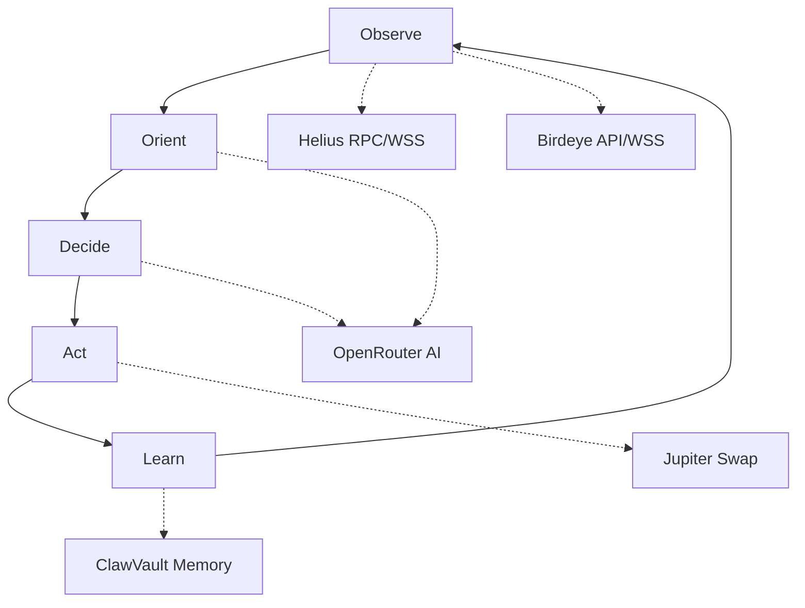

# Agent loop (NanoSolana OODA)

The TamaGObot agent runs a continuous **OODA loop** (Observe → Orient → Decide → Act)
for autonomous trading. Each loop cycle processes market data, reasons through the
AI provider, and optionally executes trades.

## Entry points

- Gateway: automatic heartbeat-driven loop.
- CLI: `nanosolana run` (foreground OODA loop).
- API: `POST /api/agent` (single turn).
- Channels: Telegram/Discord message triggers an agent turn.

## How it works (high-level)



### 1. Observe

- Fetch real-time market data from **Helius** (Solana RPC + WebSocket).
- Pull token analytics from **Birdeye** (price, volume, OHLCV).
- Read wallet balance and recent transactions.
- Read ClawVault KNOWN tier for fresh data (<60s).

### 2. Orient (AI-powered)

- Inject observations into the AI provider (OpenRouter/healer-alpha).
- System prompt is loaded from **SOUL.md** (TamaGObot identity).
- AI analyzes market conditions using RSI, EMA, ATR indicators.
- ClawVault LEARNED tier provides historical pattern context.
- Returns structured market analysis.

### 3. Decide (AI-powered)

- AI proposes a structured trade decision:
  ```json
  {
    "action": "BUY" | "SELL" | "HOLD",
    "token": "SOL",
    "confidence": 0.85,
    "reasoning": "RSI oversold + EMA crossover confirmed",
    "risk": { "stopLoss": -2, "takeProfit": 5 }
  }
  ```
- Confidence threshold enforced (default: 0.7 minimum).
- Position sizing based on Kelly Criterion adaptation.

### 4. Act

- High-confidence decisions trigger Jupiter swap execution.
- Low-confidence decisions are logged but not executed.
- All actions broadcast via gateway as `trade:signal` events.
- TamaGOchi pet mood updated based on trade outcomes.

### 5. Learn

- Trade outcomes stored in ClawVault LEARNED tier.
- Strategy engine auto-optimizes parameters based on results.
- Contradictions detected and resolved in INFERRED tier.
- Lessons broadcast to mesh network peers.

## Queueing + concurrency

- Runs are serialized per session (session lane).
- Trading operations are atomic — no concurrent position changes.
- Channel messages queue behind active OODA cycles.

## Memory integration

Three-tier ClawVault memory feeds into every OODA cycle:

| Tier | TTL | Purpose |
|------|-----|---------|
| **KNOWN** | 60s | Fresh API data (prices, balances) |
| **LEARNED** | 7 days | Patterns from trade outcomes |
| **INFERRED** | 3 days | Correlations held loosely |

## Prompt assembly

System prompt is built from:

1. **SOUL.md** — TamaGObot identity and trading philosophy.
2. **ClawVault context** — relevant memories from all three tiers.
3. **Market data** — current prices, indicators, wallet state.
4. **Pet status** — TamaGOchi mood affects risk tolerance.
5. **Conversation context** — for channel-triggered turns.

## Streaming + events

| Event | Description |
|-------|-------------|
| `lifecycle:start` | OODA cycle began |
| `lifecycle:observe` | Data collection phase |
| `lifecycle:orient` | AI analysis phase |
| `lifecycle:decide` | Decision phase |
| `lifecycle:act` | Execution phase |
| `lifecycle:learn` | Memory storage phase |
| `lifecycle:end` | Cycle complete |
| `trade:signal` | New trading signal generated |
| `market:price` | Price update observed |
| `memory:lesson` | New lesson learned |

## Heartbeat

- Default interval: `30m` (configurable via `heartbeat.every`).
- Each heartbeat triggers a lightweight OODA cycle.
- `HEARTBEAT_OK` response suppresses delivery (no spam).
- Active hours configurable to avoid overnight API costs.
- TamaGOchi heartbeat runs alongside — pet status updates.

## Timeouts

- Default OODA cycle timeout: 600s.
- API call timeout: 30s per external service.
- AI inference timeout: 120s.
- Trade execution timeout: 60s.

## Where things can end early

- OODA timeout (abort)
- Insufficient wallet balance (skip trade)
- Market closed / no data (wait)
- Gateway disconnect
- AbortSignal (cancel)
