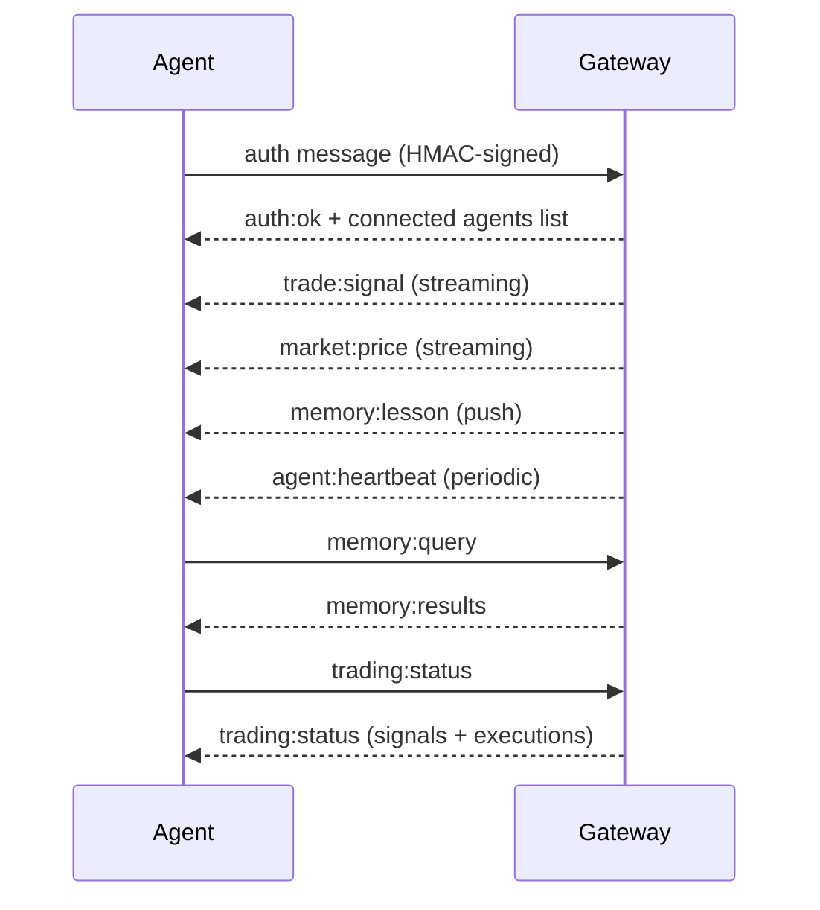

# Gateway architecture

## Overview

- A single long-lived **NanoSolana Gateway** owns all communication surfaces
  (Telegram, Discord, Nostr, iMessage, WebChat, and extension channels).
- The Gateway also serves as the real-time **trading signal relay** and
  **memory synchronization** hub across the agent mesh.
- Control-plane clients (macOS app, CLI, web UI, NanoHub) connect over
  **WebSocket** on the configured bind host (default `127.0.0.1:18789`).
- **Mesh nodes** (other TamaGObots via Tailscale) connect with `role: node`
  and declare capabilities.
- One Gateway per host; it is the single authority for the agent's wallet
  session and trading engine.

## Components and flows

### Gateway (daemon)

- Maintains channel provider connections (Telegram polling/webhooks, Discord WS, etc.).
- Maintains Solana RPC + WebSocket connections (Helius, Birdeye).
- Exposes a typed WS API (requests, responses, server-push events).
- Validates inbound frames against JSON Schema.
- Emits events: `agent`, `trade:signal`, `market:price`, `memory:lesson`,
  `agent:heartbeat`, `presence`, `health`.

### Clients (NanoHub / CLI / macOS app)

- One WS connection per client.
- Send requests (`health`, `status`, `send`, `agent`, `trade`).
- Subscribe to events (`tick`, `agent`, `trade:signal`, `presence`, `shutdown`).

### Mesh nodes (other TamaGObots)

- Connect to the **same WS server** with `role: node`.
- Provide agent identity + wallet public key on `connect`.
- Can share memory entries, relay signals, and coordinate strategies.

### Security model

- **HMAC-SHA256 authentication** on all WebSocket connections.
- **Rate limiting** per IP and per agent (100 msgs/min default).
- **Origin checking** — configurable allowed origins.
- **Wallet-signed identity** — Ed25519 signatures verify agent identity.
- **Encrypted secrets** — all API keys stored with AES-256-GCM in vault.
- **Timing-safe comparison** for all secret/token checks.
- **X-NanoSolana-Secret** header support for HTTP API endpoints.

## Connection lifecycle



## Wire protocol

- Transport: WebSocket, text frames with JSON payloads.
- First frame **must** be `auth` with HMAC-SHA256 signature.
- After handshake:
  - Messages: `{ type, payload, from, to?, timestamp, signature? }`
  - Broadcast: omit `to` field.
  - Direct: set `to` to target agent ID.
- The gateway secret is configured via `NANO_GATEWAY_SECRET` or
  `gateway.secret` in config.

## Message types

| Type | Direction | Description |
|------|-----------|-------------|
| `auth` | Agent → Gateway | Authentication with HMAC signature |
| `auth:ok` | Gateway → Agent | Successful auth + peer list |
| `agent:heartbeat` | Both | Periodic liveness check |
| `trade:signal` | Gateway → Agents | New trading signal from strategy engine |
| `market:price` | Gateway → Agents | Real-time price update |
| `memory:query` | Agent → Gateway | Search ClawVault memory |
| `memory:results` | Gateway → Agent | Memory search results |
| `memory:store` | Agent → Gateway | Store new memory entry |
| `memory:lesson` | Gateway → Agents | Broadcast learned lesson |
| `trading:status` | Both | Trading engine status |

## HTTP API endpoints

All `/api/*` endpoints require the `X-NanoSolana-Secret` header when
`gateway.secret` is configured.

| Endpoint | Method | Description |
|----------|--------|-------------|
| `/health` | GET | Liveness check (no auth required) |
| `/api/status` | GET | Full agent status (wallet, memory, trading) |
| `/api/framework` | GET | Framework metadata snapshot |
| `/api/memory` | GET | Memory stats + recent lessons |

## Remote access

- **Preferred**: Tailscale VPN for mesh networking.
- **Fallback**: SSH tunnel.

```bash
ssh -N -L 18789:127.0.0.1:18789 user@gateway-host
```

## Operations

- Start: `nanosolana gateway run --port 18789`
- Health: `nanosolana gateway health`
- Status: `nanosolana gateway status`
- Logs: `nanosolana logs --follow`

## Invariants

- Exactly one Gateway per host controls the agent wallet session.
- Auth is mandatory; any unsigned first frame is rejected.
- Events are not replayed; clients must refresh on reconnect.
- Trading signals are broadcast to all connected mesh nodes.
- Memory lessons propagate across the mesh in real-time.
