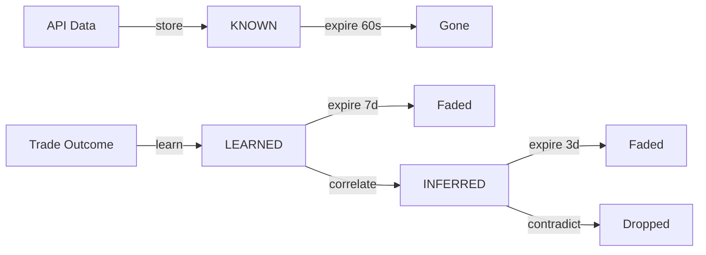

# Memory (ClawVault)

NanoSolana uses the **ClawVault** epistemological memory system — a 3-tier architecture
that distinguishes between data freshness, learned patterns, and inferred correlations.
This prevents the agent from conflating "I just saw this price" with "I noticed this
pattern over 50 trades."

## Three tiers

### KNOWN (fresh data, <60s TTL)

- Raw API responses: prices, balances, order books.
- Source: Helius RPC, Birdeye API, Jupiter quotes.
- Auto-expires after 60 seconds.
- Never persisted to disk (ephemeral cache).
- The agent can say: "SOL is at $142.50 right now."

### LEARNED (patterns, 7-day TTL)

- Derived from trade outcomes and market observations.
- Examples:
  - "RSI < 30 + volume spike → 72% chance of bounce (based on 15 trades)"
  - "Monday mornings have lower volatility (based on 8 weeks data)"
- Updated after every trade execution with outcome data.
- Persisted to `~/.nanosolana/clawvault/learned.json`.
- The agent can say: "In my experience, this pattern usually leads to..."

### INFERRED (correlations, 3-day TTL)

- Hypotheses and correlations held loosely.
- Examples:
  - "This token seems correlated with BTC moves (weak signal)"
  - "High gas → fewer swaps → less slippage (tentative)"
- Subject to contradiction detection — if new data contradicts, the inference is dropped.
- Persisted to `~/.nanosolana/clawvault/inferred.json`.
- The agent can say: "I suspect that..." (never presents as fact).

## Memory lifecycle



## Temporal decay

All entries have a creation timestamp and TTL. The memory engine runs periodic
garbage collection:

```typescript
// Decay check (runs every 5 minutes)
for (const entry of vault.entries()) {
  const age = Date.now() - entry.createdAt;
  if (age > entry.ttl) {
    vault.remove(entry.id);
  }
}
```

## Experience replay

After every trade, the memory engine performs **experience replay**:

1. Fetch the last 20 trade outcomes.
2. Find patterns: which indicators were present before profitable trades?
3. Store new LEARNED entries with supporting evidence count.
4. Update existing LEARNED entries with new confidence scores.
5. Generate INFERRED entries from weak correlations.

## Contradiction detection

When new data contradicts an existing INFERRED entry:

1. Compare new observation with stored inference.
2. If directly contradicted (e.g., "token X is NOT correlated with BTC"), drop the inference.
3. If weakly contradicted, reduce confidence by 50%.
4. Log contradiction for audit trail.

## Research agenda

ClawVault maintains a **research agenda** — questions the agent wants to answer:

```json
{
  "agenda": [
    {
      "question": "Does high Birdeye volume predict Jupiter swap success?",
      "status": "investigating",
      "evidence": 3,
      "createdAt": 1710000000000
    }
  ]
}
```

The OODA loop's **Orient** phase checks the research agenda and will prioritize
data collection that helps answer open questions.

## Memory tools (CLI)

```bash
nanosolana memory status        # Show tier counts and sizes
nanosolana memory search "RSI"  # Search across all tiers
nanosolana memory store "..."   # Manually store a memory
nanosolana memory flush         # Persist all to disk
nanosolana memory lessons       # List LEARNED entries
```

## Memory tools (agent-facing)

- `memory_search` — semantic search across all tiers.
- `memory_get` — read a specific memory entry by ID.
- `memory_store` — store a new entry in a specific tier.

## Telegram persistence integration

The Telegram conversation store (`TelegramConversationStore`) integrates with
ClawVault for persistent chat memory:

- Every message is stored with chat/user context.
- Conversation summaries are auto-generated for long chats.
- Context is rebuilt from summary + recent messages for LLM prompts.
- Cross-chat search enables finding info across all conversations.

## Configuration

```json5
{
  memory: {
    // ClawVault settings
    clawvault: {
      path: "~/.nanosolana/clawvault",
      knownTTL: 60000,        // 60s
      learnedTTL: 604800000,  // 7 days
      inferredTTL: 259200000, // 3 days
      maxEntries: 10000,
      replayDepth: 20,        // trades for experience replay
      gcInterval: 300000,     // 5 min GC cycle
    },
    // Telegram persistence
    telegram: {
      path: "~/.nanosolana/telegram",
      maxHistoryPerChat: 200,
      summaryThreshold: 50,
      persistInterval: 30000, // 30s flush
    },
    // Vector search (optional)
    search: {
      enabled: true,
      provider: "openrouter",
      model: "openrouter/healer-alpha",
    }
  }
}
```

## File layout

```
~/.nanosolana/
├── clawvault/
│   ├── known.json          # Ephemeral (rarely on disk)
│   ├── learned.json        # Persistent patterns
│   ├── inferred.json       # Tentative correlations
│   ├── agenda.json         # Research questions
│   └── replay/             # Experience replay logs
├── telegram/
│   ├── messages.json       # Per-chat message history
│   └── contexts.json       # Chat contexts + preferences
└── vault.enc               # Encrypted secrets (AES-256-GCM)
```

## Security

- All memory files have `0600` permissions (owner-only).
- Wallet private keys are NEVER stored in memory tiers.
- API keys are NEVER stored in memory tiers.
- Sensitive trade details are redacted in LEARNED entries.
- Memory files are excluded from git via `.gitignore`.
