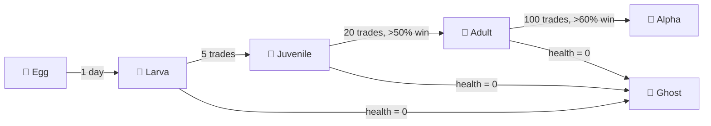

# TamaGOchi pet engine

Every NanoSolana agent has a virtual pet — the **TamaGOchi** — that is born with
the agent's wallet and evolves based on trading performance.

## Lifecycle



## Birth

The TamaGOchi is "born" when the agent wallet is created:

```bash
nanosolana birth
```

This:
1. Generates an Ed25519 keypair (Solana wallet).
2. Encrypts the private key in the vault (AES-256-GCM).
3. Creates the TamaGOchi egg with the wallet's first heartbeat.
4. Records the birth timestamp in `~/.nanosolana/pet.json`.

## Stats

| Stat | Range | Description |
|------|-------|-------------|
| Hunger | 0-100 | Increases over time; feed to reset |
| Health | 0-100 | Drops when hungry/sad; recovers when fed |
| Mood | Enum | Affects trading risk tolerance |
| Stage | Enum | Determines evolution buffs |

## Mood × Trading

The pet's mood directly modifies the trading engine's risk parameters:

| Mood | How triggered | Position size modifier |
|------|---------------|----------------------|
| 😊 Happy | Recent wins | +10% |
| 😐 Content | Normal | 0% |
| 😢 Sad | Recent losses | -15% |
| 🤢 Hungry | Not fed in 24h | -10% |
| 🤒 Sick | Losses + hungry | -30% |
| 👻 Ghost | Health = 0 | **Trading disabled** |

## Feeding

The pet needs feeding to stay alive:

```bash
nanosolana pet feed
```

- Hunger resets to 0.
- Health slowly recovers (if it was declining).
- Mood improves by one level.

## Heartbeat integration

The TamaGOchi pulse runs alongside the trading heartbeat:

```
Every heartbeat tick (30m default):
  1. Increment hunger by 2%
  2. If hunger > 80%: mood → Hungry
  3. If hunger > 95%: health -= 5
  4. If health = 0: stage → Ghost (trading stops)
  5. Check evolution eligibility
  6. Persist pet state to disk
```

## Evolution

Evolution happens automatically when requirements are met:

| Stage | Requirements |
|-------|-------------|
| Egg → Larva | 1 day alive |
| Larva → Juvenile | 5 trades executed |
| Juvenile → Adult | 20 trades, >50% win rate |
| Adult → Alpha | 100 trades, >60% win rate |
| Any → Ghost | Health reaches 0 |

## Recovery from Ghost

If the pet enters Ghost state:

1. Feed the pet: `nanosolana pet feed`.
2. Health starts recovering (1%/hour).
3. Once health > 50%, pet reverts to previous stage.
4. Trading remains disabled until health > 50%.

## File

Pet state stored at `~/.nanosolana/pet.json`:

```json
{
  "name": "NanoLobster",
  "stage": "adult",
  "mood": "happy",
  "hunger": 35,
  "health": 92,
  "bornAt": 1710000000000,
  "lastFed": 1710050000000,
  "trades": 47,
  "wins": 32,
  "evolutionHistory": [
    { "from": "egg", "to": "larva", "at": 1710086400000 },
    { "from": "larva", "to": "juvenile", "at": 1710200000000 },
    { "from": "juvenile", "to": "adult", "at": 1710800000000 }
  ]
}
```
