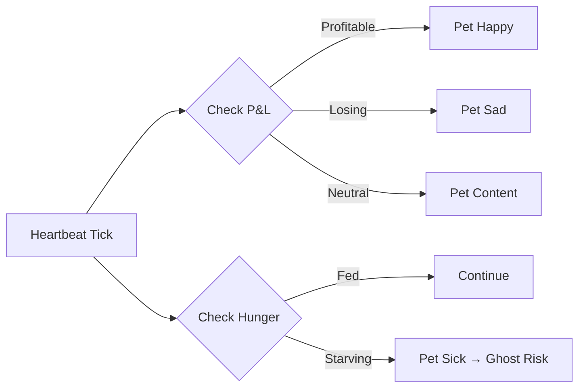

# Heartbeat

The TamaGObot heartbeat serves dual purposes:

1. **Trading heartbeat** — periodic OODA loop cycles for market monitoring.
2. **TamaGOchi pulse** — pet status updates tied to the agent's wallet.

## Quick start

```json5
{
  agents: {
    defaults: {
      heartbeat: {
        every: "30m",            // OODA cycle interval
        target: "last",          // deliver alerts to last channel
        lightContext: true,      // only inject HEARTBEAT.md
        activeHours: {
          start: "08:00",
          end: "24:00"
        }
      }
    }
  }
}
```

## Defaults

- **Interval**: `30m` (configurable via `heartbeat.every`; `0m` to disable).
- **Prompt**: reads `HEARTBEAT.md` if it exists, then runs a lightweight OODA scan.
- **Response contract**: `HEARTBEAT_OK` = all clear (suppressed). Any other text = alert (delivered).

## Trading heartbeat

Each heartbeat triggers a lightweight OODA cycle:

```
1. Check KNOWN tier for stale data → refresh from Helius/Birdeye
2. Scan for signal conditions (RSI/EMA crossover)
3. Check open positions for stop-loss/take-profit
4. If alert needed → deliver to target channel
5. If nothing → reply HEARTBEAT_OK (suppressed)
```

## TamaGOchi pulse

The pet engine updates alongside the trading heartbeat:

- **Hunger**: increases every heartbeat (feed to reset).
- **Mood**: tied to recent P&L performance.
- **Evolution**: checked on each heartbeat tick.
- **Ghost state**: triggered if health reaches 0 (trading disabled).



## HEARTBEAT.md

Optional workspace file for custom heartbeat behavior:

```markdown
# NanoSolana Heartbeat Checklist

- Check SOL wallet balance (≥0.1 SOL minimum)
- Scan for RSI < 25 opportunities (deep oversold)
- Monitor open positions: check stop-loss/take-profit
- If TamaGOchi hunger > 80%: remind user to feed
- If daily P&L > +5%: send celebration message
```

## Active hours

Restrict heartbeats to trading hours:

```json5
heartbeat: {
  every: "15m",
  activeHours: {
    start: "09:00",
    end: "22:00",
    timezone: "America/New_York"
  }
}
```

Outside this window, heartbeats are skipped. TamaGOchi pulse still runs
(pet gets hungry even at night).

## Delivery targets

| Target | Description |
|--------|-------------|
| `none` | Run OODA but don't deliver (default) |
| `last` | Deliver to last active channel |
| `telegram` | Always deliver to Telegram |
| `discord` | Always deliver to Discord |
| `nostr` | Broadcast to Nostr relays |

## Cost awareness

Heartbeats run full OODA cycles with AI inference. Shorter intervals = more tokens.
Recommended minimum: `15m` (to avoid API rate limits and costs).

For budget-conscious setups:
- Use `lightContext: true` (smaller prompt).
- Use a cheaper model for heartbeats: `heartbeat.model: "openrouter/healer-alpha"`.
- Set `target: "none"` for silent monitoring.
