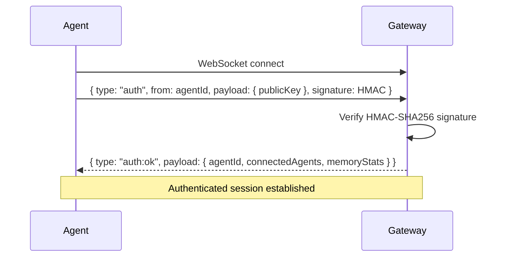

# Gateway protocol

The NanoSolana Gateway uses a WebSocket-based protocol for all agent communication.

## Transport

- **Protocol**: WebSocket (text frames, JSON payloads).
- **Default endpoint**: `ws://127.0.0.1:18789`.
- **Encryption**: TLS optional (recommended for remote access via Tailscale).

## Authentication handshake



### Auth message format

```json
{
  "type": "auth",
  "from": "agent-abc123",
  "payload": {
    "publicKey": "Ed25519PublicKey...",
    "metadata": {
      "version": "1.0.0",
      "platform": "darwin",
      "capabilities": ["trading", "memory", "chat"]
    }
  },
  "timestamp": 1710000000000,
  "signature": "hmac-sha256-hex-string"
}
```

### Signature computation

```
payload = JSON.stringify({ type, from, timestamp })
signature = HMAC-SHA256(gateway_secret, payload).hex()
```

### Auth response

```json
{
  "type": "auth:ok",
  "from": "gateway",
  "payload": {
    "agentId": "agent-abc123",
    "connectedAgents": ["agent-abc123", "agent-xyz789"],
    "memoryStats": { "known": 42, "learned": 156, "inferred": 23 }
  },
  "timestamp": 1710000000001
}
```

## Message format

All messages after authentication follow this format:

```json
{
  "type": "string",
  "payload": {},
  "from": "agent-id",
  "to": "target-agent-id (optional, omit for broadcast)",
  "timestamp": 1710000000000,
  "signature": "optional-hmac"
}
```

## Message types

### Trading events

| Type | Direction | Payload |
|------|-----------|---------|
| `trade:signal` | Gateway → All | `{ action, token, confidence, reasoning }` |
| `market:price` | Gateway → All | `{ token, price, change24h, volume }` |
| `trading:status` | Agent ↔ Gateway | `{ signals, executions, memoryStats }` |

### Memory events

| Type | Direction | Payload |
|------|-----------|---------|
| `memory:query` | Agent → Gateway | `"search query string"` |
| `memory:results` | Gateway → Agent | `[{ content, tier, score }]` |
| `memory:store` | Agent → Gateway | `{ type, content, tags, importance }` |
| `memory:lesson` | Gateway → All | `{ lesson, evidence, confidence }` |

### Lifecycle events

| Type | Direction | Payload |
|------|-----------|---------|
| `agent:heartbeat` | Both | `{ agentId, walletBalance, petStatus }` |
| `agent:status` | Agent → Gateway | `{ uptime, trades, memory }` |

## Rate limiting

- **10 connections/minute** per IP address.
- **100 messages/minute** per agent ID.
- Exceeding limits results in `4029` WebSocket close code.

## Error codes

| Code | Meaning |
|------|---------|
| `4001` | Auth timeout (no auth message within 5s) |
| `4002` | Expected auth message (wrong first message type) |
| `4003` | Invalid HMAC signature |
| `4004` | Malformed auth payload |
| `4029` | Rate limited |
| `1001` | Gateway shutting down (graceful) |

## Broadcast vs direct

- **Broadcast**: omit `to` field → message sent to all connected agents.
- **Direct**: set `to` to target agent ID → delivered only to that agent.
- Gateway never routes messages to the sender.

## Reconnection

- Clients should implement exponential backoff on disconnect.
- Events are NOT replayed; clients must re-query state after reconnect.
- Re-authentication is required on every new WebSocket connection.
